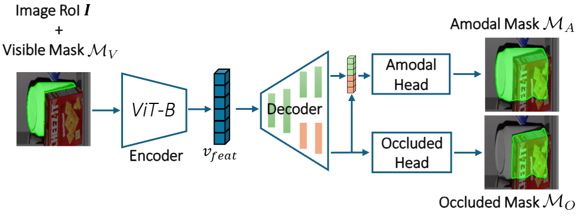
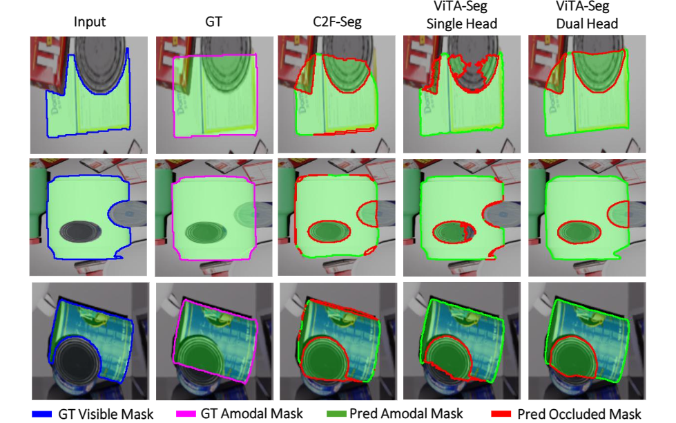
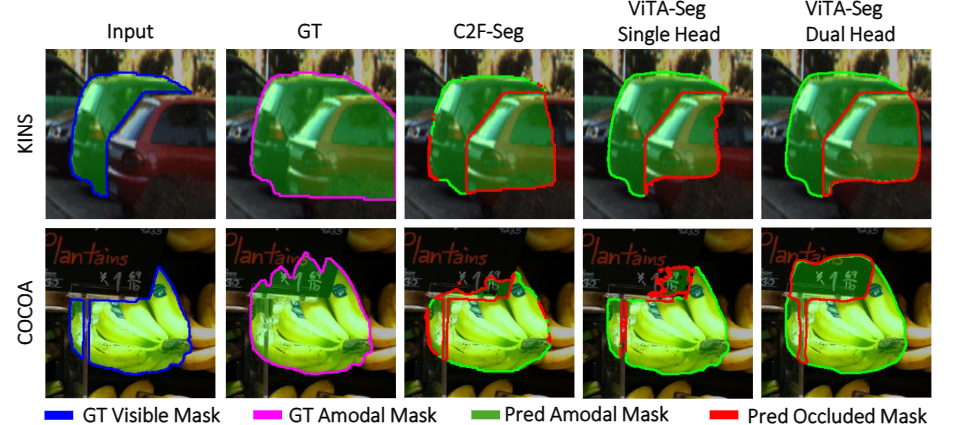

# ViTA-Seg: Vision Transformer for Amodal Segmentation in Robotics

[](https://www.python.org/downloads/)
[](https://pytorch.org/)
[](https://opensource.org/licenses/MIT)

Official PyTorch implementation of the [paper] (https://arxiv.org/pdf/2512.09510) called **ViTA-Seg: Vision Transformer for Amodal Segmentation in Robotics**.

<p align="center">
  
  <br>
  <em>Figure 1: The proposed ViTA-Seg Dual Head architectures.</em>
</p>

<p align="center">
  
  <br>
  <em>Figure 2: The qualitative results estimated by C2F-Seg, ViTA-Seg Single Head and Dual Head on ViTA-SimData.</em>
</p>

<p align="center">
  
  <br>
  <em>Figure 3: The qualitative results estimated by C2F-Seg, ViTA-Seg Single Head and Dual Head on COCOA and KINS.</em>
</p>

---

## 🚀 Key Features

- **Hybrid Architecture**: Shared early decoder for common features + task-specific late decoders for specialized features
- **Fusion Mechanism**: Cross-task collaboration between amodal and occluded predictions
- **Multi-Dataset Support**: ViTASim, COCOA, and KINS datasets
- **Full Resolution Evaluation**: Proper alignment for fair comparison with C2F-Seg baseline
- **Vision Transformer Backbone**: Pretrained ViT-Base from timm

---

## 📊 Performance

Performance comparison of ViTA-Seg and C2F-Seg models on the validation datasets:

<table>
<thead>
  <tr>
    <th rowspan="2">Model</th>
    <th colspan="3">KINS</th>
    <th colspan="3">COCOA</th>
    <th colspan="3">ViTA-SimData</th>
    <th rowspan="2">t<sub>inf</sub></th>
  </tr>
  <tr>
    <th>mIoU<sub>A</sub></th>
    <th>mIoU<sub>V</sub></th>
    <th>mIoU<sub>O</sub></th>
    <th>mIoU<sub>A</sub></th>
    <th>mIoU<sub>V</sub></th>
    <th>mIoU<sub>O</sub></th>
    <th>mIoU<sub>A</sub></th>
    <th>mIoU<sub>V</sub></th>
    <th>mIoU<sub>O</sub></th>
  </tr>
</thead>
<tbody>
  <tr>
    <td>C2F-Seg</td>
    <td>87.89</td>
    <td>72.12</td>
    <td>57.30</td>
    <td>87.15</td>
    <td>92.52</td>
    <td>36.69</td>
    <td>85.17</td>
    <td>90.67</td>
    <td>53.28</td>
    <td>113.77</td>
  </tr>
  <tr>
    <td>ViTA-Seg Single-Head</td>
    <td>89.94</td>
    <td><strong>98.84</strong></td>
    <td>60.05</td>
    <td>91.57</td>
    <td><strong>99.63</strong></td>
    <td>27.65</td>
    <td>88.31</td>
    <td>91.01</td>
    <td>49.33</td>
    <td><strong>8.54</strong></td>
  </tr>
  <tr>
    <td>ViTA-Seg Dual-Head</td>
    <td><strong>91.12</strong></td>
    <td>98.65</td>
    <td><strong>63.48</strong></td>
    <td><strong>93.70</strong></td>
    <td>99.38</td>
    <td><strong>49.88</strong></td>
    <td><strong>91.09</strong></td>
    <td><strong>91.48</strong></td>
    <td><strong>58.65</strong></td>
    <td>8.96</td>
  </tr>
</tbody>
</table>

**Metrics:**
- mIoU<sub>A</sub>: Mean IoU for Amodal masks
- mIoU<sub>V</sub>: Mean IoU for Visible masks
- mIoU<sub>O</sub>: Mean IoU for Occluded regions
- t<sub>inf</sub>: Inference time per instance (ms)

**Key Results:**
- ✅ ViTA-Seg Dual-Head achieves **best overall performance** across all datasets
- ✅ **13x faster** inference than C2F-Seg (8.96ms vs 113.77ms)
- ✅ Superior amodal and occluded segmentation on COCOA and KINS
- ✅ Single-Head variant optimal for visible mask prediction

---

## 📥 Installation

### Using Conda (Recommended)

```bash
# Clone the repository
git clone https://github.com/D0d0-10/vita-seg-hybrid-fused.git
cd vita-seg-hybrid-fused

# Create conda environment
conda env create -f environment.yml
conda activate vita-seg
```

### Using Pip

```bash
pip install -r requirements.txt
```

### Requirements

- Python >= 3.9
- PyTorch >= 2.0.0
- CUDA >= 11.8 (for GPU support)

---

## 📁 Dataset Preparation

### Expected Directory Structure

```
data/
├── ViTASim/
│   ├── train2014/
│   ├── val2014/
│   ├── ViTASim_amodal_train2014_with_classes.json
│   └── ViTASim_amodal_val2014_with_classes.json
├── COCOA/
│   ├── train2014/
│   ├── val2014/
│   ├── COCO_amodal_train2014_with_classes.json
│   └── COCO_amodal_val2014_with_classes.json
└── KINS/
    ├── training/image_2/
    ├── testing/image_2/
    ├── update_train_2020.json
    └── update_test_2020.json
```

Update dataset paths in `config_dual_head_hybrid_fused.yaml` if needed.

---

## 🏋️ Training

### Basic Training

```bash
python training_dual_head_hybrid_fused.py --config config_dual_head_hybrid_fused.yaml
```

### Training with Custom Occluded Weight

```bash
python training_dual_head_hybrid_fused.py \
    --config config_dual_head_hybrid_fused.yaml \
    --occluded-weight 0.25
```

### Resume Training \ Fine-Tuning on Your Own Dataset

```bash
python training_dual_head_hybrid_fused.py \
    --config config_dual_head_hybrid_fused.yaml \
    --resume path/to/checkpoint.pth
```

### Key Training Arguments

- `--config`: Path to configuration file
- `--occluded-weight`: Override occluded loss weight (0.25-0.50)
- `--resume`: Path to checkpoint to resume from
- `--reset-epoch`: Reset epoch counter when resuming

---

## 📊 Evaluation

### Full Resolution Evaluation

```bash
python test_cocoa_fullres_aligned.py \
    --model your_model_run_name \
    --model-type dual-hybrid-fused
```

### Single Sample Testing

```bash
python test_single_sample_fullres_aligned.py \
    --model your_model_run_name \
    --model-type dual-hybrid-fused \
    --index 0
```

## 📦 Model Files

### Core Architecture
- `model_dual_head_hybrid_fused.py` - Main model implementation
- `model.py` - Base ViT encoder with pretrained support
- `dataset.py` - Data loaders for ViTASim, COCOA, KINS

### Training & Evaluation
- `training_dual_head_hybrid_fused.py` - Training script with WandB integration
- `test_cocoa_fullres_aligned.py` - Test evaluation script on the benchmarks
- `test_single_sample_fullres_aligned.py` - Single sample visualization, selecting an index (--index) or image ID (image_id)
- `evaluation_metrics.py` - Comprehensive metrics computation

## 🛠️ Configuration

Edit `config_dual_head_hybrid_fused.yaml` to customize:
- Dataset selection (`vitasim`, `cocoa`, `kins`, `all`)
- Model architecture (embed_dim, depth, num_heads)
- Training hyperparameters (lr, batch_size, epochs)
- Loss weights (amodal, occluded, bce)
- WandB project settings

---

## 📄 License

This project is licensed under the MIT License - see the LICENSE file for details.

---

## 🙏 Acknowledgments

- Vision Transformer implementation from [timm](https://github.com/huggingface/pytorch-image-models)
- Amodal segmentation benchmarks: [COCOA](https://arxiv.org/abs/1509.01329), [KINS](https://arxiv.org/abs/1811.11397)
- Inspired by [C2F-Seg](https://github.com/amazon-science/c2f-seg?tab=readme-ov-file)

---

## 📧 Contact

For questions or issues, please open an issue on GitHub.

---

## ⭐ Citation

If you use this code in your research, please cite:

```bibtex
@article{caramia2025vitasegvisiontransformeramodal,
      title={ViTA-Seg: Vision Transformer for Amodal Segmentation in Robotics}, 
      author={Donato Caramia and Florian T. Pokorny and Giuseppe Triggiani and Denis Ruffino and David Naso and Paolo Roberto Massenio},
      year={2025},
      eprint={2512.09510},
      archivePrefix={arXiv},
      primaryClass={cs.RO},
      url={https://arxiv.org/abs/2512.09510}, 
}
```
